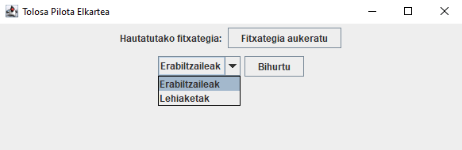

# Tolosa Pilota Kirol Elkartea - Java aplikazioa

- [Tolosa Pilota Kirol Elkartea - Java aplikazioa](#tolosa-pilota-kirol-elkartea-java-aplikazioa)
    - [Interfazearen azalpena](#interfazearen-azalpena)
        - [Botoiak](#botoiak)
        - [Desplegablea](#desplegablea)
    - [Klase egitura orokorra](klase-egitura-orokorra)
        - [Klaseak](#klaseak)
        - [Metodoak](#metodoak)
        - [Layout klasearen atributuak](#layout-klasearen-atributuak)

## Interfazearen azalpena

### Botoiak

- **Fitxategia aukeratu**: botoia sakatzean, .csv fitxategia hautatzeko leihoa irekitzen da.

- **Bihurtu**: botoia sakatzean, .csv fitxategia .sql fitxategi bihurtzeko prozesua hasten da.

### Desplegablea

- **Erabiltzaileak/Lehiaketak**: erabiltzaileen edo lehiaketen fitxategi datuak bihurtzeko aukera.

## Klase egitura orokorra

Aplikazioaren klase, metodo eta atributuen azalpen orokorra.

### Klaseak

- **Erronka**: .csv fitxategiak .sql-era bihurtzen dituen aplikazioa exekutatzen duen klasea.

- **Layout**: .csv fitxategiak .sql-era bihurtzen dituen aplikazio klasea.

### Metodoak

- *Erronka*
    - **main**: Aplikazioren sarrera nagusia. Programa hasten denean exekutatzen den metodoa da.
        - **run**: Interfaze grafikoa eraikiko da metoda exekutatzerakoan.

- *Layout*
    - **Layout**: Layout klasearen metodo eraikitzailea.
        - **actionPerformed**: botoia sakatzean ekintza bat egingo duen metodoa.
    - **fitxategiaSortu**: .sql fitxategia sortzen duen metodoa.
    - **bihurtuErabiltzailea**: Erabiltzaileen .csv fitxategia .sql fitxategi batean bihurtu.
    - **bihurtuLehiaketa**: Lehiaketen .csv fitxategia .sql fitxategi batean bihurtu.
    - **formatuaEman**: .csv fitxategian dagoen informazioa .sql fitxategia onartzen duen formatura bihurtzen duen metodoa.
    - **tryParseInt**: String balorea int bihurtu ahal dadin ala ez adierazten duen metodoa.

### Layout klasearen atributuak

- **frame**: Aplikazioaren lehioa.
- **mainPanel**: Lehioan dagoen panel nagusia.
- **topPanel**: Panel nagusiaren barruan dagoen goiko panela.
- **centerPanel**: Panel nagusiaren barruan dagoen erdiko panela.
- **comboBox**: Erabiltzaileak/Lehiaketak aukerak hautatzeko desplegablea
- **selectLabel**: .csv fitxategia aukeratzeko botoiaren etiketa.
- **selectButton**: .csv fitxategia aukeratzeko botoia.
- **selectFileChooser**: .csv fitxategia aukeratzeko lehioa.
- **destinationFileChooser**: .sql fitxategia gordetzeko lehioa.
- **actionButton**: .csv fitxategia .sql fitxategi bihurtzeko botoia.